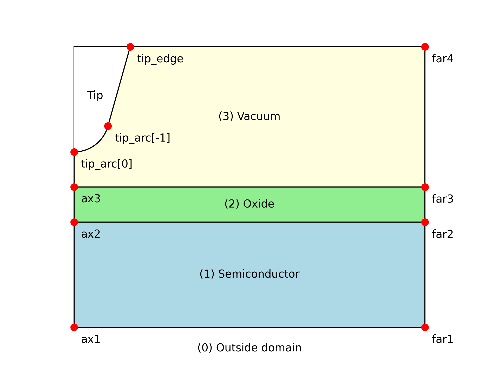

# FEM Simulation for AFM Tip-Sample Electrostatic Potential

AFM 探針下の半導体（SiC/SiO₂）における静電ポテンシャルを有限要素法（FEM）と Newton 法で計算するシミュレーションコード。

## 概要

このコードは以下を計算する：
- AFM 探針直下の半導体中の静電ポテンシャル分布
- 酸化膜（SiO₂）と真空領域を含む軸対称モデル

使用ライブラリ：
- **NGSolve**: FEM ソルバー
- **Netgen**: メッシュ生成
- **NumPy / SciPy**: 数値計算

## セットアップ

[README.md](../README.md) を参照。

## 使い方

### 基本的な実行

```bash
# デフォルト設定（config.toml）で実行
python main.py

# 設定ファイルを指定して実行
python main.py path/to/config.toml

# ログファイルを指定して実行
python main.py config.toml simulation.log
```

### config.toml の設定項目

```toml
out_dir = "results/example"  # 出力ディレクトリ

[physical_parameters]
# 省略時はデフォルト値を使用（SiC 4H-SiC のパラメータ）
# T = 300.0                    # 温度 [K]
# Nd = 1e22                    # ドナー濃度 [m^-3]
# Na = 0.0                     # アクセプター濃度 [m^-3]
# sigma = 1e15                 # 界面電荷密度 [m^-2]
# epsilon_sem = 9.7            # 半導体の比誘電率
# Eg = 3.26                    # バンドギャップ [eV]
# Ed = [0.124, 0.066]          # ドナー準位 [eV]
# donor_ratios = [1.0, 1.88]   # ドナー準位の比率

[geometric_parameters]
tip_sample_distance = 5.0e-9  # 探針-試料間距離 [m]（必須）
# l_vac = 200.0e-9             # 真空層の厚さ [m]
# l_ox = 1.0e-9                # 酸化膜の厚さ [m]
# l_sem = 195.0e-9             # 半導体層の厚さ [m]
# l_radius = 500.0e-9          # シミュレーション領域の半径 [m]
# tip_radius = 40.0e-9         # 探針先端の曲率半径 [m]
# tip_slope_deg = 15.0         # 探針の傾斜角 [度]

[simulation_parameters]
Vtip_list = [-1.0, -0.5, 0.0, 0.5, 1.0]  # 探針電圧のリスト [V]（必須）
# maxit = 100                  # Newton 法の最大反復回数
# maxerr = 1e-11               # 収束判定の誤差閾値
# dampfactor = 1               # ダンピング係数（1 = ダンピングなし）
```

### 出力ファイル

実行後、`out_dir` に以下のファイルが生成される：

```
results/example/
├── config.toml              # 入力設定のコピー
├── params.toml              # 計算されたパラメータ（$E_f$, $N_c$, $N_v$ 等）
├── Vtip_-1.00V/
│   ├── potential_dimless.npy     # 無次元化されたポテンシャル（全節点）
│   ├── potential_axis.csv        # z軸上のポテンシャル [nm, V]
│   └── potential_interface.csv   # 界面上のポテンシャル [nm, V]
├── Vtip_-0.50V/
│   └── ...
└── ...
```

## ファイル構成

| ファイル                  | 説明                                                           |
| ------------------------- | -------------------------------------------------------------- |
| `main.py`                 | エントリーポイント。設定読み込み、メッシュ生成、FEM 実行を制御 |
| `fem.py`                  | FEM ソルバー本体。弱形式の定義と Newton 法による求解           |
| `physical_parameters.py`  | 物理パラメータ（温度、ドーピング、誘電率等）の管理             |
| `geometry.py`             | ジオメトリとメッシュ生成（Netgen を使用）                      |
| `fermi_dirac_integral.py` | フェルミ・ディラック積分 $F_{1/2}$ の近似実装                  |
| `load_config.py`          | TOML 設定ファイルの読み込み                                    |
| `config.toml`             | デフォルト設定ファイル                                         |
| `assets/geometry.png`     | ジオメトリの図解                                               |

## 物理モデル

### 座標系

軸対称円筒座標系 $(r, z)$ を使用。対称軸は $r = 0$。



- **(1) Semiconductor**: 半導体（SiC）
- **(2) Oxide**: 酸化膜（SiO₂）
- **(3) Vacuum**: 真空領域（探針を含む）

### 支配方程式

ポアソン方程式：

$$
\nabla \cdot (\varepsilon \nabla \varphi) = -\rho
$$

ここで：
- $\varphi$: 静電ポテンシャル
- $\varepsilon$: 誘電率（領域ごとに異なる）
- $\rho$: 電荷密度

### 電荷密度

半導体中の電荷密度：

$$
\rho = q(p - n + N_D^+ - N_A^-)
$$

- $n$: 電子密度（フェルミ・ディラック統計）
- $p$: 正孔密度（フェルミ・ディラック統計）
- $N_D^+$: イオン化ドナー濃度
- $N_A^-$: イオン化アクセプター濃度

電子・正孔密度はフェルミ・ディラック積分 $F_{1/2}$ を用いて計算：

$$
n = N_c \cdot F_{1/2}\left(\frac{E_f - E_g}{kT} + \frac{q\varphi}{kT}\right)
$$

$$
p = N_v \cdot F_{1/2}\left(-\frac{E_f}{kT} - \frac{q\varphi}{kT}\right)
$$

$F_{1/2}$ には Aymerich-Humet らの近似式を使用。

### 境界条件

| 境界                 | 条件                                                                       | 説明               |
| -------------------- | -------------------------------------------------------------------------- | ------------------ |
| Tip (`bc_tip`)       | Dirichlet: $\varphi = V_\mathrm{tip}/kT$                                   | 探針電圧           |
| Ground (`bc_ground`) | Dirichlet: $\varphi = 0$                                                   | 半導体底面（接地） |
| Far-field (`bc_far`) | Robin: $\varepsilon \partial\varphi/\partial n + (\varepsilon/L)\varphi=0$ | 遠方境界（減衰）   |
| Axis (`bc_axis`)     | 自然境界条件                                                               | 対称軸             |

### 無次元化

数値安定性のため、以下の無次元化を行う：

- 長さ: $L_c = 1\ \mathrm{nm}$（特徴的長さ）
- ポテンシャル: $\varphi' = q\varphi/kT$（熱電圧で規格化）

## 実装の詳細

### Newton 法の収束戦略

1. **直接解法**: まず通常の Newton 法で収束を試みる
2. **Homotopy 法**: 収束しない場合、非線形項を徐々に導入
   - 電荷密度を $\lambda \rho$ として、$\lambda$ を 0 から 1 へ 10 段階で増加
   - 各段階で Newton 法を適用

### Vtip_list の処理順序

収束性を高めるため、以下の順序で解く：

1. まず $V_\mathrm{tip} = 0\ \mathrm{V}$ を解く（初期解）
2. 正の電圧を昇順で解く（0V の解から継続）
3. 0V の解に戻す
4. 負の電圧を降順（0 に近い順）で解く

これにより、各電圧の解が前の解の良い初期値となる。

### 数値安定化

- **clamp 関数**: ポテンシャルを $[-120, 120]$ にクリップして $\exp$ のオーバーフローを防止
- **safe_exp 関数**: $\exp$ の引数を $[-40, 40]$ にクリップ
- **abs_smooth 関数**: $|x|$ を $\sqrt{x^2 + \epsilon^2}$ で滑らかに近似

## 拡張・修正のガイド

### 新しい物理パラメータの追加

1. `physical_parameters.py` の `PhysicalParameters` クラスにフィールドを追加
2. `__post_init__` で必要な計算を行う
3. `config.toml` の `[physical_parameters]` セクションで値を指定

```python
# physical_parameters.py
@dataclass
class PhysicalParameters:
    # 既存のフィールド...
    new_param: float = 1.0  # 新しいパラメータ
```

### 境界条件の変更

`fem.py` の `_setup_weak_form` 関数を修正：

```python
# fem.py:149-153
# 弱形式への寄与を追加/変更
a += epsilon_r * ng.grad(uh) * ng.grad(vh) * ng.x * ng.dx  # 拡散項
a += epsilon_r * robin_coeff * uh * vh * ng.x * ng.ds(geom.bc_far)  # Robin BC
a += -rho * vh * ng.x * ng.dx(...)  # 電荷密度
a += -sigma * vh * ng.x * ng.ds(geom.bc_intf)  # 界面電荷
```

### 出力の追加

`fem.py` の `_save_potential` 関数を修正：

```python
# fem.py:219-267
def _save_potential(...):
    # 既存の保存処理...

    # 新しい出力を追加
    new_data_path = dir_path / "new_data.csv"
    # データ計算...
    np.savetxt(new_data_path, data, header="...", delimiter=",")
```

### ジオメトリの変更

1. `geometry.py` の `GeometricParameters` にパラメータを追加
2. `create_mesh` 関数でメッシュ生成ロジックを修正
3. 必要に応じて `assets/geometry.png` を更新

## 参考文献

- Aymerich-Humet, X., Serra-Mestres, F., & Millan, J. (1983). A generalized approximation of the Fermi-Dirac integrals. *Journal of Applied Physics*, 54(5), 2850-2851.
- Ikeda, M., Matsunami, H., & Tanaka, T. (1980). Site effect on the impurity levels in 4H, 6H, and 15R SiC. *Physical Review B*, 22(6), 2842-2854.
