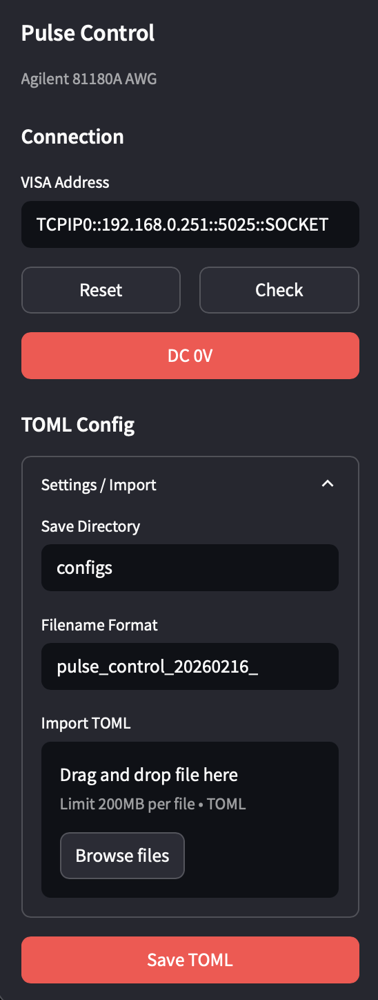
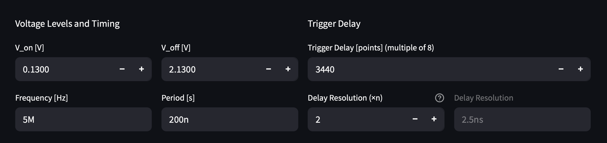
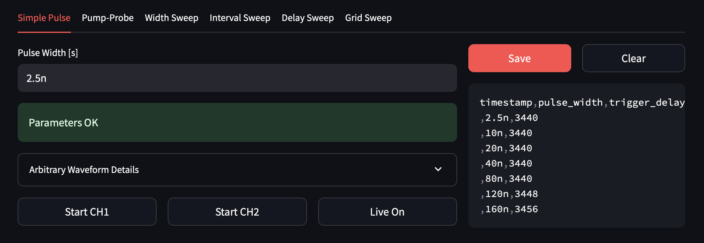
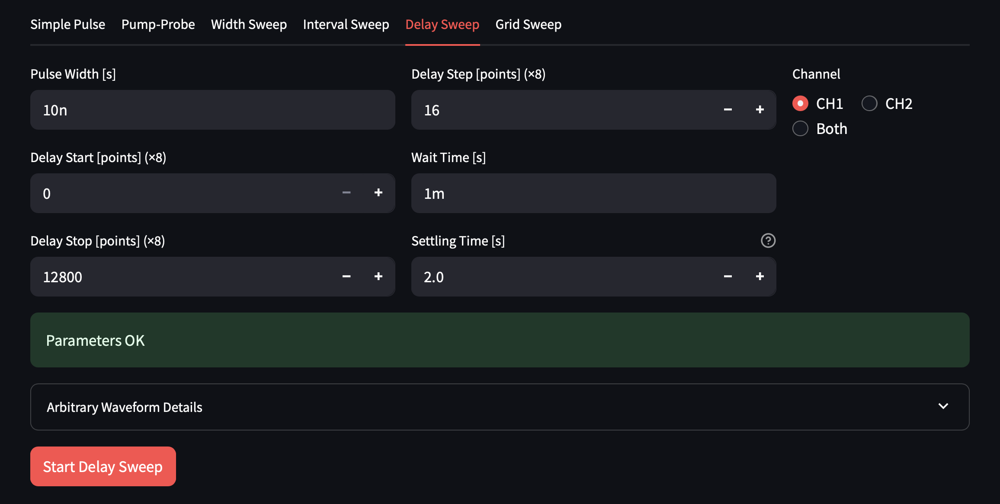
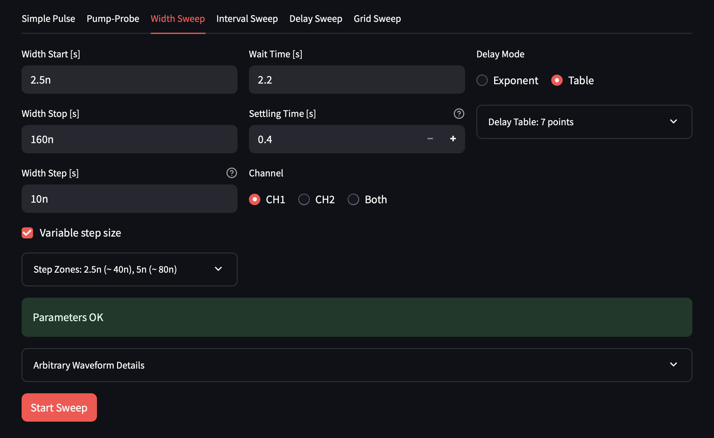
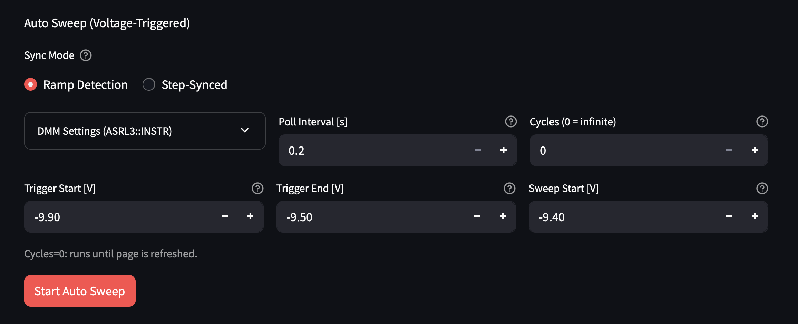

# Pulse Control ユーザーガイド

## 1. はじめに

本ガイドでは、Agilent 81180A 任意波形発生器 (AWG) を制御するための Streamlit アプリケーションおよび CLI ツールの使い方を説明します。

### 対象範囲

本ガイドで扱う機能は以下の通りです。

| タブ / モード   | 用途                                            |
| --------------- | ----------------------------------------------- |
| Simple Pulse    | 単一パルスの出力・トリガーディレイの手動探索    |
| Width Sweep     | パルス幅掃引 (オートトリガー含む)               |
| Delay Sweep     | トリガーディレイ掃引                            |
| CLI integration | 外部電圧ランプに同期した自動掃引 (長時間放置用) |

波形生成は全て **アービタリ (ARB) モード** を使用します。アービタリモードでは、各サンプル点ごとに DAC 値を指定した波形データを AWG に送信します。

### 対象ハードウェア

- **Agilent 81180A** 任意波形発生器 — LAN (TCP/IP) 接続
- **Agilent 34401A** デジタルマルチメータ — USB-Serial 接続 (オートトリガー使用時のみ)

### 起動方法

```bash
cd pulse_control
uv run streamlit run app.py
```

ブラウザが自動で開きます。閉じてしまった場合は、ターミナルに表示される URL (通常 `http://localhost:8501`) にアクセスしてください。

---

## 2. 画面構成

### 2.1 サイドバー

<!--  -->


#### 接続設定

`VISA Address` に AWG の VISA アドレスを入力します。デフォルト値は `TCPIP0::192.168.0.251::5025::SOCKET` です。

VISA アドレスの構成:

| 部分            | 意味                                                                |
| --------------- | ------------------------------------------------------------------- |
| `TCPIP0`        | プロトコル                                                          |
| `192.168.0.251` | AWG の IP アドレス (本体の Utility > Remote Interface > LAN で確認) |
| `5025`          | ポート番号 (デフォルト値)                                           |
| `SOCKET`        | 接続方式                                                            |

- `Check` — AWG に `*IDN?` コマンドを送り、接続を確認します。成功するとデバイス名が表示されます。
- `Reset` — `VISA Address` をデフォルト値に戻します。
- `DC 0V` — 全チャンネルの出力を DC 0V にします。実験中に緊急停止したい場合に使用します。

#### 設定ファイルの管理

`Settings / Import` を開くと、設定ファイルの保存・読み込みができます。

- `Save Directory` — 保存先ディレクトリ (デフォルト: `configs`)
- `Filename Format` — ファイル名の接頭辞。連番が自動付与されます (例: `pulse_control_001.toml`)
- `Import TOML` — 既存の TOML 設定ファイルを読み込み、全パラメータを UI に反映します

実験前に設定を保存しておくと、後から同じ条件を再現できます。

---

### 2.2 共通パラメータ



タブの上に配置された共通パラメータは、全モードで共有されます。

#### 電圧とタイミング

| パラメータ       | 説明                                      |
| ---------------- | ----------------------------------------- |
| `V_on [V]`       | パルス ON 時の電圧                        |
| `V_off [V]`      | パルス OFF 時 (ベースライン) の電圧       |
| `Frequency [Hz]` | パルスの繰り返し周波数                    |
| `Period [s]`     | パルスの繰り返し周期 (`Frequency` と連動) |

`Frequency [Hz]` と `Period [s]` は双方向に連動しており、片方を変更するともう片方が自動更新されます。

> **V_on / V_off の注意点**:
> 内部的にはアンプリチュードとオフセットに変換して AWG に送信しています。`V_on` と `V_off` は「パルスが ON のときの電圧」「OFF のときの電圧」を直感的に指定するためのインターフェースです。ただし、実際の出力電圧はオシロスコープ等で確認してください。特に `V_on` < `V_off` の場合 (反転パルス) でも正しく動作しますが、表示値と出力の対応が直感に反する場合があります。

#### トリガーディレイ

| パラメータ                               | 説明                                                    |
| ---------------------------------------- | ------------------------------------------------------- |
| `Trigger Delay [points] (multiple of 8)` | パルスの出力タイミングのオフセット (サンプルポイント数) |
| `Delay Resolution (×n)`                  | サンプリング分解能の倍率                                |

**トリガーディレイ** はパルスの出力タイミングを調整するパラメータで、 **8 の倍数** でなければなりません。

アービタリモードでは波形を離散的なサンプル点で表現しており、トリガーディレイを 8 変えると **8 × (1サンプルあたりの時間)** だけパルスがずれます。例えばサンプル間隔が 1 ns の場合、ディレイを 8 変えると 8 ns ずれます。

`Delay Resolution (×n)` を大きくすると 1 サンプルあたりの時間が短くなり、より細かいタイミング制御が可能になります。ただし上限は AWG のサンプルレート (最大 4.2 GSa/s) で決まります。

> **波形詳細の確認**: 各タブには `Arbitrary Waveform Details` という展開パネルがあり、セグメント数・サンプルレート・ポイント間隔・ディレイ分解能などを確認できます。

---

## 3. Simple Pulse



単一パルスを出力するモードです。主に **トリガーディレイの手動探索** に使用します。

### 3.1 パルス幅の設定

`Pulse Width [s]` にパルス幅を入力します。SI 接頭辞が使えます (例: `10n` = 10 ns、`50u` = 50 us)。

パルスは周期の中央に配置されます。この配置は固定であり、変更できません。

### 3.2 チャンネル出力の開始 / 停止

- `Start CH1` / `Start CH2` — 対応するチャンネルでパルス出力を開始します
- `Stop CH1` / `Stop CH2` — 出力を停止します

CH1 と CH2 は独立して制御できます。

### 3.3 ライブ接続モード

`Live On` を押すと、AWG との接続を維持したままリアルタイムで `Trigger Delay [points] (multiple of 8)` を調整できます。

- ライブモード中は、共通パラメータ領域でトリガーディレイを変更すると即座に AWG に反映されます
- **同期されるのはトリガーディレイのみ** です。パルス幅や電圧など他のパラメータはライブモードでは反映されません
- `Live Off` で接続を切断します

### 3.4 トリガーディレイ探索の典型的なワークフロー

1. パルス幅・電圧などのパラメータを設定する
2. `Start CH1` でパルス出力を開始する
3. `Live On` でライブモードに入る
4. オシロスコープ等で信号を観測しながら `Trigger Delay [points] (multiple of 8)` を調整する
5. 最適なディレイ値が見つかったら `Save` で記録する
6. 異なるパルス幅について繰り返し、Width Sweep の `Table` モード用データを蓄積する

> **注意**: パルス幅を変更する場合は一度ライブモードを切り、再度 `Start` → `Live On` の手順を踏む必要があります。

### 3.5 記録の保存

- `Save` — 現在のパルス幅とトリガーディレイの値を CSV に保存します
- `Clear` — 保存済みの記録を全てクリアします

この記録は Width Sweep の `Table` モードでディレイ対応表として活用できます (5.1 節参照)。

---

## 4. Delay Sweep



パルス幅を固定し、トリガーディレイを掃引するモードです。

### 4.1 パラメータの設定

| パラメータ                         | 説明                     |
| ---------------------------------- | ------------------------ |
| `Pulse Width [s]`                  | パルス幅 (固定)          |
| `Delay Start [points] (×8)`        | 掃引開始ディレイ値       |
| `Delay Stop [points] (×8)`         | 掃引終了ディレイ値       |
| `Delay Step [points] (×8)`         | ディレイのステップ幅     |
| `Wait Time [s]`                    | 1ステップごとの待機時間  |
| `Settling Time [s]`                | 掃引開始前の初期待機時間 |
| `Channel` — `CH1` / `CH2` / `Both` | 出力チャンネル           |

全てのディレイ値は **8 の倍数** です。

`Wait Time [s]` はステップ間の待機時間です。信号送信の遅延があるため、0 に設定すると掃引が速すぎてデータが乱れる場合があります。1 ms 程度を推奨します。

`Settling Time [s]` は掃引の最初のステップで出力が安定するまでの待機時間です。初期値から大きく変化する場合に過渡応答を避けるために設定します。

### 4.2 掃引の実行

`Start Delay Sweep` を押すと掃引が開始されます。掃引中は進捗が表示されます。

---

## 5. Width Sweep

パルス幅を掃引するモードです。掃引設定とオートトリガー設定の 2 つのセクションがあります。

### 5.1 掃引パラメータ



#### 基本パラメータ

| パラメータ                         | 説明                     |
| ---------------------------------- | ------------------------ |
| `Width Start [s]`                  | 掃引開始パルス幅         |
| `Width Stop [s]`                   | 掃引終了パルス幅         |
| `Width Step [s]`                   | パルス幅のステップ       |
| `Wait Time [s]`                    | 1ステップごとの待機時間  |
| `Settling Time [s]`                | 掃引開始前の初期待機時間 |
| `Channel` — `CH1` / `CH2` / `Both` | 出力チャンネル           |

パルス幅の種類ごとに個別の波形セグメントを作成して AWG に送信するため、ディレイ掃引と比べて **1ステップの切替に時間がかかります**。全セグメントは掃引開始前にまとめてアップロードされ、掃引中はセグメントの切り替えのみ行います。

`Wait Time [s]` は **2 秒程度** を推奨します。短すぎるとデータが乱れることがあります (過渡応答の影響)。

#### 可変ステップゾーン

`Variable step size` にチェックを入れると、パルス幅の範囲に応じて異なるステップ幅を使用できます。

`Step Zones` を展開して設定します。例:

| 設定                                                      | 意味                             |
| --------------------------------------------------------- | -------------------------------- |
| `Zone 1: width ≤ [s]` = `40n`, `Zone 1 step [s]` = `2.5n` | 40 ns 以下の領域では 2.5 ns 刻み |
| `Zone 2: width ≤ [s]` = `87n`, `Zone 2 step [s]` = `5n`   | 40–87 ns の領域では 5 ns 刻み    |
| (上記に該当しない範囲)                                    | `Width Step [s]` の値が使われる  |

狭いパルス幅の領域を細かく、広い領域を粗く掃引することで、掃引時間を短縮できます。

#### トリガーディレイ連動

パルス幅が変わるとき、最適なトリガーディレイも変わります。`Delay Mode` でディレイの連動方法を選択します。

**Exponent モード**

`Trigger Delay Stop [points] (×8)` と `Delay Exponent` を設定すると、パルス幅に応じてディレイが自動計算されます。指数が 1 なら線形補間です。

**Table モード** (推奨)

Simple Pulse で手動探索した (パルス幅, ディレイ) の対応表を使います。`Delay Lookup Table` を展開して値を入力します。掃引中は表の値を線形補間してディレイを算出します。

> **典型的なワークフロー**: まず Simple Pulse タブでいくつかのパルス幅についてトリガーディレイを探索・`Save` → その記録を Table モードに入力 → Width Sweep を実行

#### 掃引の実行

`Start Sweep` を押すと、以下の順序で実行されます:

1. 全パルス幅に対応する波形セグメントを一括アップロード
2. 幅ごとに順番にセグメントを切り替え、各ステップで `Wait Time [s]` だけ待機

---

### 5.2 オートトリガー (Ramp Detection)



外部の電圧ランプ信号 (例: 温度コントローラの出力) に同期して、掃引を自動的に繰り返すモードです。

#### 概要

Agilent 34401A マルチメータで外部電圧を監視し、電圧ランプの立ち上がりを検出したタイミングで掃引を開始します。これにより、長時間の自動測定が可能になります。

#### DMM 接続設定

`DMM Settings (...)` を展開して設定します。

| パラメータ         | 説明                                              |
| ------------------ | ------------------------------------------------- |
| `DMM VISA Address` | マルチメータの VISA アドレス (例: `ASRL3::INSTR`) |

- `Check DMM` — DMM への接続を確認します
- `Read Once` — DMM から電圧を 1 回読み取り、値を表示します (動作確認用)

#### ランプ検出パラメータ

`Sync Mode` で `Ramp Detection` を選択します。

| パラメータ              | 説明                    |
| ----------------------- | ----------------------- |
| `Trigger Start [V]`     | 電圧読み取り開始の閾値  |
| `Trigger End [V]`       | 電圧読み取り終了の閾値  |
| `Sweep Start [V]`       | 掃引を開始する電圧      |
| `Poll Interval [s]`     | DMM の読み取り間隔      |
| `Cycles (0 = infinite)` | 繰り返し回数 (0 で無限) |

これらの電圧値は大小関係の制約があります: `Trigger Start [V]` < `Trigger End [V]` < `Sweep Start [V]`

**動作の流れ**:

1. DMM で電圧を `Poll Interval [s]` ごとに読み取る
2. `Trigger Start [V]` を超えたらデータ収集を開始
3. `Trigger End [V]` を超えたら収集を終了し、収集データから線形回帰を行う
4. 回帰結果から `Sweep Start [V]` に到達する時刻を予測
5. その時刻に合わせて掃引を自動開始
6. 掃引完了後、電圧が下がるのを待ち、次のサイクルへ

`Start Auto Sweep` で開始します。

> **注意**: 長時間実行すると Streamlit のメモリにデータが蓄積されます。UI で確認した後は、CLI の integration モード (6 章参照) での実行を推奨します。

---

## 6. CLI による自動掃引 (main.py integration)

### 6.1 用途

Streamlit UI のオートトリガーと同等の機能を、コマンドラインから実行します。

- UI は設定の確認や短時間の動作テストに使用
- **長時間の放置実験** では CLI を使用 (メモリ蓄積の問題がない)

### 6.2 設定ファイルの準備

UI で設定を調整・確認した後、サイドバーの `Settings / Import` から TOML ファイルを保存します。保存されたファイルには `[common]`、`[width_sweep]`、`[integration]` など全セクションが含まれます。

設定ファイルの主要セクション:

```toml
[connection]
visa_address = "TCPIP0::192.168.0.251::5025::SOCKET"

[common]
v_on = 0.13
v_off = 2.13
frequency = 5000000.0
trigger_delay = 0
resolution_n = 2

[width_sweep]
width_start = 1e-8
width_stop = 1.67e-7
width_step = 7e-9
wait_time = 2.0
settling_time = 0.0
delay_mode = "table"
delay_table = [[3e-8, 160], [6e-8, 320], [1.2e-7, 640]]
step_zones = [[4e-8, 2.5e-9], [8.7e-8, 5e-9]]

[integration]
dmm_visa_address = "ASRL3::INSTR"
trigger_start_voltage = -9.8
trigger_end_voltage = -9.2
sweep_start_voltage = -9.0
poll_interval = 0.2
num_cycles = 0
```

### 6.3 実行コマンド

```bash
uv run python -m pulse_control integration configs/your_config.toml
```

### 6.4 実行の流れ

1. 設定ファイルを読み込み、バリデーションを実行
2. AWG への接続を確認 (`*IDN?`)
3. DMM への接続を確認
4. 全波形セグメントをアップロード
5. DMM で電圧を監視し、ランプ検出 → 掃引開始
6. `num_cycles = 0` の場合、Ctrl+C で停止するまで繰り返し

### 6.5 ログの確認

- **ターミナル**: INFO レベル以上のメッセージが表示されます (掃引の進捗、エラー等)
- **`logs/` ディレクトリ**: DEBUG レベルを含む詳細ログが保存されます。実際に AWG に送信している SCPI コマンドなども記録されており、問題が発生した際のデバッグに使えます

---

## 付録

### A. TOML 設定ファイルの構造

設定ファイルは以下のセクションで構成されます。使用しないモードのセクションが含まれていても問題ありません。

| セクション       | 内容                                               |
| ---------------- | -------------------------------------------------- |
| `[save]`         | 保存先ディレクトリ、ファイル名フォーマット         |
| `[connection]`   | AWG の VISA アドレス                               |
| `[common]`       | 電圧、周波数、トリガーディレイ等の共通パラメータ   |
| `[simple_pulse]` | Simple Pulse のパルス幅                            |
| `[width_sweep]`  | Width Sweep の掃引範囲・ステップ・ディレイ連動設定 |
| `[delay_sweep]`  | Delay Sweep の掃引範囲・ステップ                   |
| `[integration]`  | Ramp Detection (オートトリガー) の設定             |

### B. トラブルシューティング

| 症状                       | 対処                                                                                                                       |
| -------------------------- | -------------------------------------------------------------------------------------------------------------------------- |
| `Check` で接続できない     | AWG の電源・LAN ケーブルを確認。IP アドレスは AWG 本体の Utility > Remote Interface > LAN で確認                           |
| バリデーションエラーが出る | エラーメッセージに従ってパラメータを修正。特にトリガーディレイの 8 の倍数制約に注意                                        |
| 掃引中にデータが乱れる     | `Wait Time [s]` を大きくする (2 秒程度推奨)                                                                                |
| DMM に接続できない         | USB-Serial アダプタのドライバを確認。Windows の場合、デバイスマネージャーで COM ポート番号を確認し `ASRL[N]::INSTR` を設定 |
| 長時間実行で UI が重くなる | CLI の integration モードを使用 (6 章参照)                                                                                 |
